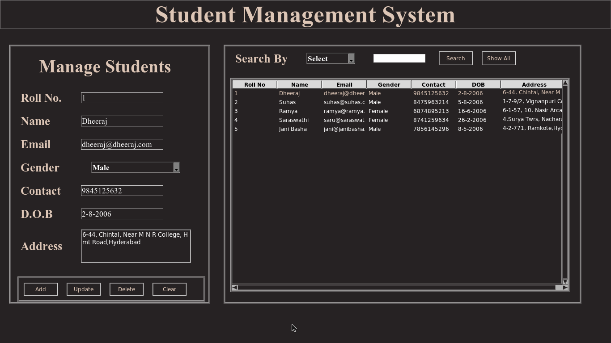

# Student-Mgt

A Simple Python3 based Student Management system made using Tkinter Module

Description
============

Student Management System is a simple application to store and retrive Student details.This application also provides updation and deletion functionality

Features
=========

*Registration & Login functionality available 
*Can store & retrive Student Details(Stored in Mysql Database) 
*Logout and Forget Password functionality available 
*Update and Delete functionality also available 

Usage
=======

*Install Python3 and Install tkinter,pymysql Modules 
*Install mysql database in System and create username and password 
*Create required databases,tables and data fields for Registration and Student Management applications to store and retrive data 
*Change the databases and table names if required in main applications 
*Execute registration.py to register,then login using login form to open main application(stdmgt.py)

